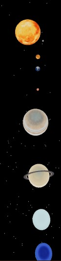
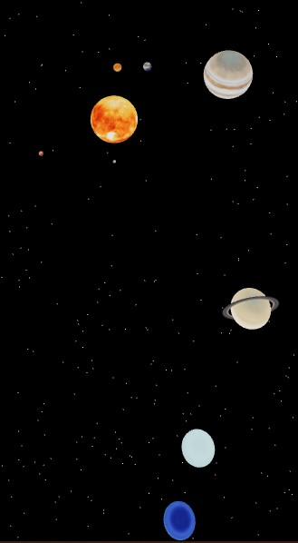
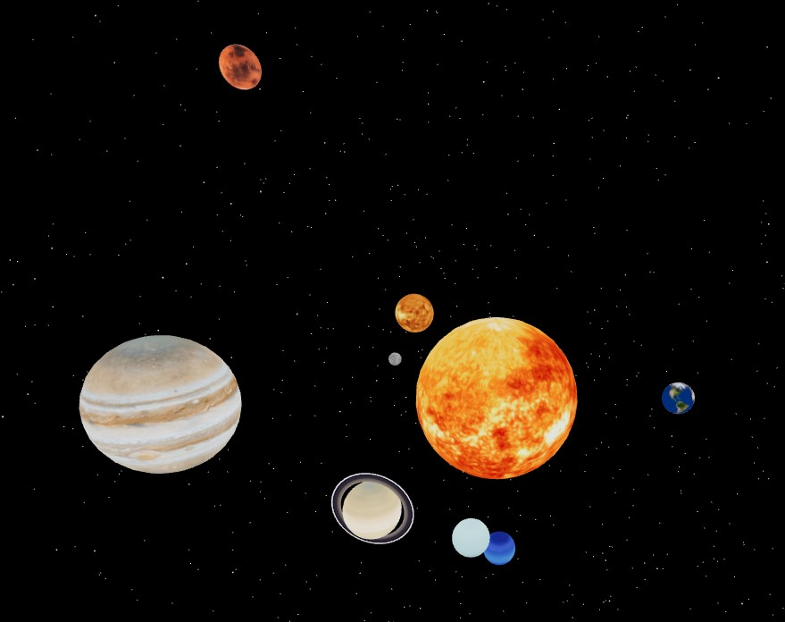

# Solar System

## A Solar System 3D model

This web app uses the React Three.js libraries - `react-three/fiber`, `react-three/drei`, and `three`.

These libraries are used to build a 3-D model of the Solar System.

The distances and sizes of the sun and planets aare not exactly relative since they were kept closer to show more easily. However the orbiting speeds are reflective of how fast they would be relative to each other in reality. For simplicity a circular orbit was assumed.

Effectively, this is a model to show use of the React Three.js libraries and not to model the solar system completely accurately.

### Model

The images of the final model are as follows.

Initially:

After a while:

Rotating and zooming after a while:

## References

### Information of planets

The planet distances from the Sun and their diameters were taken from Wikipedia.

https://en.wikipedia.org/wiki/Solar_System

The time it took for the planets to orbit the Sun were taken from SpacePlace.

https://spaceplace.nasa.gov/years-on-other-planets/en/

### Images used

The images used to wrap around the planets were taken from Solar System Scope.

https://www.solarsystemscope.com/textures/

The images are as follows.

Sun:

Mercury:

Venus:

Earth:

Mars:

Jupiter:

Saturn:

Uranus:

Neptune:

